# 🧠 NexusQuiz - AI-Powered Adaptive Quiz Platform


#### An intelligent Quiz system that dynamically adjusts question difficulty using **Machine learning**. Features real-time performance adaptation, comprehensive analytics, and a stunning glassmorphism UI. Built with **FastAPI, Firebase**, and modern **JavaScript.**

---

## 🌟 Key Features
### 🤖 AI-Powered Adaptation
- **Machine Learning Difficulty Adjustment** - Logistic Regression model predicts optimal question difficulty

- **Real-time Performance Analysis** - Adapts question difficulty based on user responses

- **Personalized Learning Paths** - Customized quiz experience for each user

### 🎯 Smart Quiz Engine
- **Dynamic Difficulty Levels** - Easy, Medium, Hard questions adjusted in real-time

- **Progress Tracking** - Real-time performance metrics and analytics

- **Adaptive Scoring** - Intelligent scoring system that rewards improvement

- **Auto Grading System** - Instant answer evaluation and scoring

### 💫 Modern UI/UX
- **Glassmorphism Design** - Stunning frosted glass aesthetic with particle animations

- **Responsive Interface** - Beautiful design that works on all devices

- **Smooth Animations** - Engaging user experience with fluid transitions

### 🔧 Advanced Features
- **Admin Dashboard** - Comprehensive question bank management

- **API Integration** - Automatic question import from Open Trivia DB

- **Real-time Analytics** - Detailed performance insights and statistics

- **User Dashboard** - Progress visualization and tracking

---

## 🛠️ Tech Stack
### Backend & AI
- **Python** - Core programming language

- **FastAPI** - Modern, high-performance web framework

- **Scikit-Learn** - Machine learning for difficulty prediction


- **Firebase Firestore** - NoSQL database for real-time data


### Frontend & UI
- **Vanilla JavaScript** - Interactive frontend logic


- **HTML5 & CSS3** - Responsive web design with glassmorphism effects


- **Particle Animations** - Dynamic background elements

### Machine Learning

- **Logistic Regression** - Difficulty classification model

- **Real-time Analytics** - Performance pattern recognition

- **Predictive Modeling** - Skill level assessment

---

## 📂 Project Structure
```
Nexus-Quiz/
├── quiz_engine/                 # AI & ML Components
│   ├── difficulty_model.py     # ML model for difficulty prediction
│   ├── selector.py             # Question selection logic
│   ├── grader.py               # Answer evaluation system
│   └── feedback_generator.py   # Personalized feedback generation
├── backend/                    # API & Server
│   ├── main.py                # FastAPI application entry point
│   ├── models/                # Pydantic data models
│   ├── routes/                # API route handlers
│   │   ├── quiz.py           # Quiz management endpoints
│   │   ├── user.py           # User authentication & management
│   │   ├── question.py       # Question bank operations
│   │   └── result.py         # Results & analytics
│   └── db/                    # Database configuration
│       └── firebase_config.py # Firebase integration
├── frontend/                   # User Interface
│   ├── index.html            # Main application
│   ├── style.css             # Glassmorphism styles
│   └── app.js               # Frontend logic
└── requirements.txt          # Python dependencies
```

---

## 🚀 Adaptive Quiz Flow
### Process Overview:
- **Quiz Initialization** - System assesses user's starting level based on previous performance

- **Real-time Assessment** - Each answer updates skill evaluation and ML model

- **ML-Powered Adaptation** - Logistic regression predicts optimal difficulty for next question

- **Progressive Challenge** - Questions dynamically adapt to user capability

- **Comprehensive Evaluation** - Final scoring with detailed analytics and AI-generated feedback

- **Continuous Learning** - System improves from aggregated user data

---



---

## 🔧 Installation & Setup
### Prerequisites
- Python 3.8 or higher

- Firebase account and project

- Modern web browser

## Quick Start
### Clone Repository

```
git clone https://github.com/MuhammadUsman-Khan/Nexus-Quiz.git
cd Nexus-Quiz
```
### Install Dependencies
```
pip install -r requirements.txt
```
### Configure Firebase

- Create Firebase project at Firebase Console

- Download serviceAccountKey.json and place in backend/db/

- Update security rules as needed

### Run Application

```
# Start Backend Server
cd backend
uvicorn main:app --reload --port 8000

# Start Frontend (in new terminal)
python -m http.server 3000
Access Platform

Frontend: http://localhost:3000

API Documentation: http://localhost:8000/docs
```

## 🎮 Usage Guide
### For Students/Learners
- **Register Account** - Create your personalized profile with secure authentication

- **Take Adaptive Quiz** - System automatically adjusts to your skill level in real-time

- **View Real-time Progress** - Watch your performance metrics update after each question

- **Receive AI Feedback** - Get personalized improvement suggestions based on performance patterns

- **Track Learning Journey** - Monitor progress over time with detailed analytics

### For Administrators/Educators
- **Manage Question Bank** - Add, edit, or import questions with metadata

- **Import from Open Trivia DB** - Automatic question collection from external API

- **Monitor System Analytics** - Overall platform performance and usage statistics

- **User Progress Oversight** - Track individual and group learning progress

---

## 🔌 API Endpoints
### Quiz Management
```
Method      	Endpoint	                      Description
POST	  /api/quiz/start            	Initialize new adaptive quiz session
POST	  /api/quiz/submit-answer	    Evaluate answer and update user model
POST	  /api/quiz/next-question    	Get next question based on current performance
POST	  /api/quiz/end-quiz	        Finalize session and generate feedback
```

### User Management
```
Method	    Endpoint	                        Description
POST	  /api/users/register	    User registration with secure authentication
POST	  /api/users/login	      User login and session management
GET	    /api/users/{email}	    Retrieve user profile and history
```
### Question Bank
```
Method  	    Endpoint  	                                Description
GET	      /api/questions/all	                  Retrieve all questions (Admin only)
POST	    /api/questions/add	                  Add new question to bank
POST	    /api/questions/import-from-api	      Bulk import from Open Trivia DB
DELETE	  /api/questions/{id}	                  Remove question from bank
```
### Analytics & Results
```
Method  	Endpoint	    Description
GET	  /api/results/user/{email}	  Get user's quiz history and progress
GET  	/api/results/all	  System-wide analytics (Admin only)
```
